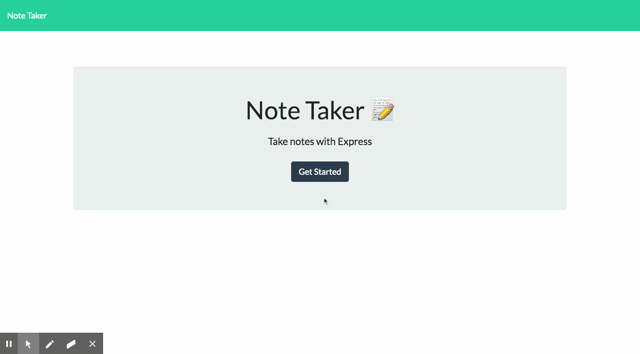

# Note Taker
A notes app using node, express, API routes - GET, POST, DELETE

### Installation

1. Clone the repo
2. Install packages
```
npm install
```
3. Start the application by running
```
node server.js
```

### Demo
